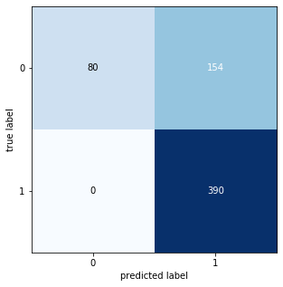

# Pneumonia detection from Chest X-ray images using Transfer Learning

**Chest x-ray** uses a very small dose of ionizing radiation to produce pictures of the inside of the chest. It is used to evaluate the lungs, heart and chest wall and may be used to help diagnose shortness of breath, persistent cough, fever, chest pain or injury. It also may be used to help diagnose and monitor treatment for a variety of lung conditions such as pneumonia, emphysema and cancer. Because chest x-ray is fast and easy, it is particularly useful in emergency diagnosis and treatment.

**Pneumonia** is an infection that inflames the air sacs in one or both lungs. The air sacs may fill with fluid or pus (purulent material), causing cough with phlegm or pus, fever, chills, and difficulty breathing. A variety of organisms, including bacteria, viruses and fungi, can cause pneumonia.
It is generally diagnosed by a medical professional and chest x-rays are an efficient way to diagnose pneumonia in a patient. 

Training a classifier on medical images is a crucial task to aid doctors and provide lower cost services to patients. If we can build a classifier that can diagnosis a given disease and provide it to patients who can't afford a doctor as an app, we have a scalable business.

The name of the dataset is "Chest X-Ray Images (Pneumonia)" where the number of classes are ```2```.

Link: https://www.kaggle.com/paultimothymooney/chest-xray-pneumonia

Number/Size of Images   : 
                          
                          Total      : 5856 (1.15 Gigabyte (GB))
                          Training   : 5216 (1.07 Gigabyte (GB))
                          Validation : 320  (42.8 Megabyte (MB))
                          Testing    : 320  (35.4 Megabyte (MB))

## Transfer Learning

**Transfer learning** makes use of the knowledge gained while solving one problem and applying it to a different but related problem. In this particular case, we have used Inceptionv3 and trained the latter layers to create CNN that can help us detect pneumonia from these chest x-ray images.


## Inception v3

Inception v3 is a widely-used image recognition model that has been shown to attain greater than 78.1% accuracy on the ImageNet dataset. The model is the culmination of many ideas developed by multiple researchers over the years. It is based on the original paper: "Rethinking the Inception Architecture for Computer Vision" by Szegedy, et. al.

The model itself is made up of symmetric and asymmetric building blocks, including convolutions, average pooling, max pooling, concats, dropouts, and fully connected layers. Batchnorm is used extensively throughout the model and applied to activation inputs. Loss is computed via Softmax.


## Results
Refer the Jupyter notebook for more detailed results and comments about the implementation of the model. The confusion matrix can be seen as follows:

